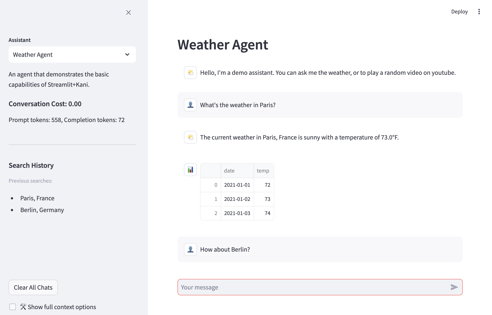

# Kani-Utils

Utilities for deploying one or more tool-using LLM agents
using the [Kani](https://kani.readthedocs.io/en/latest/index.html) and [Streamlit](https://streamlit.io/) libraries.

Features

- Define multiple agents (for different engines and/or functionality)
- Agents can render Streamlit elements to the chat stream (e.g. dataframes, images)
- Agent-defined UI elements in the sidebar (e.g., file uploads)
- Streaming responses
- Token and cost accounting
- **New** sharable chats

Screenshot:




See [demo_app.py](demo_app.py) and [demo_agents.py](demo_agents.py).

## Installation and Use

### 0. Install

With `pip`, `poetry`, etc.

```
pip install git+https://github.com/oneilsh/kani-utils.git
```

### 1. Define Agents ([demo_agents.py](demo_agents.py))

The `StreamlitKani` class extends [Kani](https://kani.readthedocs.io/en/latest/index.html), with additional
functionality to intregate with the Streamlit server and UI elements. We'll need this and a few other imports
from the `kani` and `streamlit` libraries in a `demo_agents.py` or similar:

```python
# from demo_agents.py

from kani_utils.base_kanis import StreamlitKani
from kani import AIParam, ai_function
import streamlit as st
```

Let's define an `AuthorSearchKani`, starting with the constructor, which should call the parent constructor
and define some expected agent properties. This agent will use `requests` and `pandas` later.

```python
# demo_agents.py continued

import pandas as pd
import requests

class AuthorSearchKani(StreamlitKani):
    # Be sure to override the __init__ method to pass any parameters to the superclass
    def __init__(self, *args, **kwargs):
        # if you have a system prompt, add it to the kwargs before calling super()
        kwargs["system_prompt"] = "You are a chatbot assistant that can help users find the author of a book. Always use the search_author function to find the author of a book."

        super().__init__(*args, **kwargs)

        # Define avatars for the agent and user
        # Can be URLs or emojis
        self.avatar = "📚"
        self.user_avatar = "👤"

        # The name and greeting are shown at the start of the chat
        # The greeting is not known to the LLM, it serves as a prompt for the user
        self.name = "Author Search Agent"
        self.greeting = "Hello, I'm a demo assistant. You can ask me to look up the author of a book, for example, 'Who wrote The Sorcerer's Stone?'"
        
        # The description is shown in the sidebar and provides more information about the agent
        self.description = "An agent that demonstrates the basic capabilities of Streamlit+Kani."

        # we can define any other instance variables we need for the agent
        self.search_history = []

```

And let's define an AI-callable function that retrieves information about a provided book title.
The use of `@ai_function()`, `Annotated`, and `AIParam` are described in the [Kani](https://kani.readthedocs.io/en/latest/index.html)
documentation. The function returns data to the Agent - by default results of functions are only shown to
the LLM, but the user can optionally see the full context of called functions and results via the UI.

This function additionally renders the `pandas` dataframe directly in the chat UI using Streamlit's
type-inferring `st.write()` function. Streamlit provides a [variety](https://docs.streamlit.io/develop/api-reference)
of UI elements, and most are allowed, including a sequence or nesting of them. The rendering code **must** be provided as
a callable function.

Rendered UI elements are by default displayed after the resulting answer from the Agent in the chat, even though
`@ai_function()`s are typically called **before** the agent begins its answer (an artifact of the rendering and streaming
process). The result can be shown before the model's answer by setting `delayed=False` in the call to `self.render_in_streamlit_chat`.

Lastly, we can write to the log stream with `st.session_state.logger.info()`, `st.session_state.logger.error()`, etc.

```python
# demo_agents.py continued

    @ai_function()
    def search_author(self, query: Annotated[str, AIParam(desc="The query to search for.")]):
        """Search for an author and return their name and alternative names."""

        # add the search to the search history
        self.search_history.append(query)

        # use requests lib to make the GET call and parse the result
        response = requests.get(f"https://openlibrary.org/search.json?q={query}&fields=author_name,author_alternative_name&limit=1").json()
        author_name = response["docs"][0]["author_name"][0]
        alternative_names = response["docs"][0]["author_alternative_name"]

        alt_names_df = pd.DataFrame({"alternative_names": alternative_names})

        # render the response in the chat; Streamlit has nice defaults for many data types, including pandas dataframes
        self.render_in_streamlit_chat(lambda: st.write(alt_names_df))

        st.session_state.logger.info(f"Processed request for {author_name}")

        # the return value is sent to the agent; the user can see the response by expanding the "full context" if enabled
        return f"Author: {author_name}. Alternative names: {', '.join(alternative_names)} The user has also been shown a table of alternative names."

```

Agents can also optionally define UI elements in the sidebar by implementing a `render_sidebar()` method. It is a good
idea to call `super().render_sidebar()` to render the sidebar for the parent class. If you want to be consisent with the
defaults, add a divider and use level 3 headings and caption-sized font. 

```python
# demo_agents.py continued

    def render_sidebar(self):
        # Call the superclass method to render the default sidebar elements
        super().render_sidebar()
        st.divider()

        st.markdown("### Search History")
        st.caption("Previous searches:")

        # render a list of memory keys stored in markdown
        search_history = self.search_history
        # markdown-formatted list
        st.markdown("- " + "\n- ".join(search_history))
```

The [demo_agents.py](demo_agents.py) defines several other examples:  
a `MemoryKani` with an integrated key/value store, a `FileKani` that can read the contents of uploaded files, and a `TableKani` that
can query uploaded CSV files as a relational database.


### 2. App Configuration ([demo_app.py](demo_app.py))

First, we create an `.env` file defining an `OPEN_API_KEY` environment variable (which will be used
by a corresponding Kani [engine](https://kani.readthedocs.io/en/latest/engines.html) below).

```
OPENAI_API_KEY=sk-...
```

We can also provide [upstash](https://upstash.com/) environment variables; if set, these will
enable creating share links for chats, with a configurable timeout:

```
UPSTASH_REDIS_REST_URL="https://upstash-db-name.upstash.io"
UPSTASH_REDIS_REST_TOKEN=...
```

With `.env` created, we create a `demo_app.py`, adding required imports and 
using `dotenv.load_dotenv()` to load the environment variables:


```python
# kani_streamlit imports
import kani_utils.kani_streamlit_server as ks

# for reading API keys from .env file
import os
import dotenv # pip install python-dotenv

# kani imports
from kani.engines.openai import OpenAIEngine

# load app-defined agents
from demo_agents import AuthorKani, MemoryKani, FileKani, TableKani

# read API keys .env file (e.g. set OPENAI_API_KEY=.... in .env and gitignore .env)
dotenv.load_dotenv() 
```

Next we initialize settings for the page. This MUST be called. Parameters here are
passed to `streamlit.set_page_config()`, see more at https://docs.streamlit.io/library/api-reference/utilities/st.set_page_config. 
If using chat sharing, `share_chat_ttl_seconds` defines the number of seconds a shared chat is stored once generated. The default is 60 days;
each visit to the URL resets the timer.

```python
ks.initialize_app_config(
    show_function_calls = True,
    page_title = "StreamlitKani Demo",
    page_icon = "🦀", # can also be a URL
    initial_sidebar_state = "expanded", # or "expanded"
    menu_items = {
            "Get Help": "https://github.com/.../issues",
            "Report a Bug": "https://github.com/.../issues",
            "About": "StreamlitKani is a Streamlit-based UI for Kani agents.",
        },
    share_chat_ttl_seconds = 60 * 60 * 24 * 60, # 60 days
)
```

Then, we define one more more engines (Kani supports popular [cloud and local models](https://kani.readthedocs.io/en/latest/engines.html)), and define a function that returns a dictionary mapping agent names
to agents. If `prompt_tokens_cost` and `completion_tokens_cost` (in dollars per 1k tokens), then
conversation cost tracking will be enabled.

This function must then be passed to `ks.set_app_agents()` to be used for initialization.

```python
# define an engine to use (see Kani documentation for more info)
engine = OpenAIEngine(os.environ["OPENAI_API_KEY"], model="gpt-4o")

# We also have to define a function that returns a dictionary of agents to serve
# Agents are keyed by their name, which is what the user will see in the UI
def get_agents():
    return {
            "Author Search": AuthorSearchKani(engine, prompt_tokens_cost = 0.005, completion_tokens_cost = 0.015),
            "Author Search (No Costs Shown)": AuthorSearchKani(engine),
            "Memory Agent": MemoryKani(engine, prompt_tokens_cost = 0.005, completion_tokens_cost = 0.015),
            "File Agent": FileKani(engine, prompt_tokens_cost = 0.005, completion_tokens_cost = 0.015),
            "Table Agent": TableKani(engine, prompt_tokens_cost = 0.005, completion_tokens_cost = 0.015),
           }


# tell the app to use that function to create agents when needed
ks.set_app_agents(get_agents)
```

Finally, `ks.serve_app()` will start the streamlit server.

```python
ks.serve_app()
```

### 3. Run Locally

Run the streamlit app:

```
streamlit run demo_app.py
```

### 4. Publish

Use Streamlit's [publishing functionality](https://docs.streamlit.io/deploy/streamlit-community-cloud/deploy-your-app) to deploy publicly, using secrets to store API keys and other environment variables.


# Changelog
 - 1.2: Sharable chats! Minor UI adjustments, implements single-agent chat clear. Bugfixes: keep focus on chat input.
 - 1.1: Added streaming output
 - 1.0: Moved memory functionality out of base class